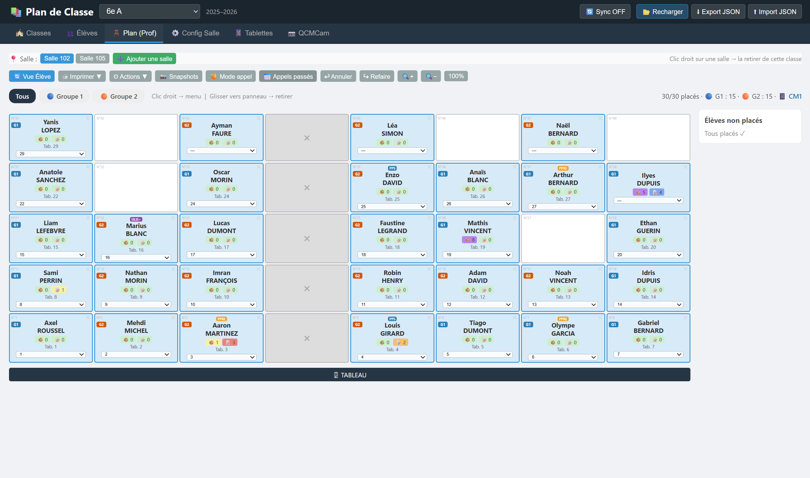
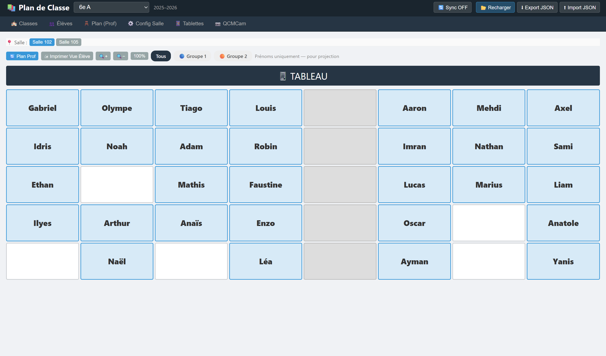
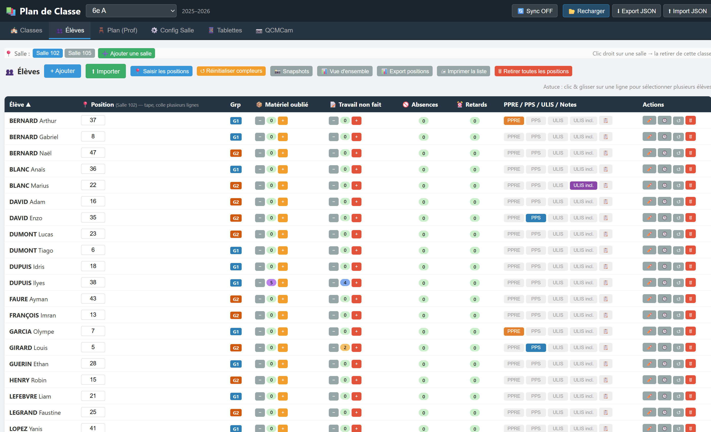

# 🪑 Plan de Classe

> **Application web mono-fichier de gestion de plans de classe et de tablettes pour enseignants.**
> Aucune installation, aucune inscription, aucun cloud obligatoire — vous ouvrez le fichier HTML, vous travaillez.

[](#licence)
[]()
[]()

> 🚀 **Essayer en ligne tout de suite** : **[belenos-toutatis.github.io/plan-de-classe/plan%20de%20classe.html](https://belenos-toutatis.github.io/plan-de-classe/plan%20de%20classe.html)**
> 📥 **Télécharger pour installer en local** : bouton vert **`<> Code`** ci-dessus → **Download ZIP** → décompresser → double-clic sur `plan de classe.html` (ou sur le script de lancement adapté à votre système — voir [Démarrage en 30 secondes](#-démarrage-en-30-secondes)).

---

## ✨ En bref

- 🎨 **Design "Carnet du prof"** : papier bleuté, filet rouge de marge, lignes Seyès en arrière-plan, typographie soignée (Fraunces serif + IBM Plex Sans + JetBrains Mono pour les chiffres) — polices embarquées, **mode sombre "veillée"** pour le soir et l'usage projeté en classe
- 🪑 **Placement drag & drop** des élèves dans la salle de classe
- 🏫 **Multi-salles par classe** (cours, demi-groupes, salle informatique…)
- 🧑‍🏫 **AESH** : 1 à 6 AESH par couple (classe, salle), placement libre ou auto, élèves accompagnés liés et placés en priorité à côté lors du mélange, présence pointable au quotidien
- 🎯 **Contraintes de placement** : places autorisées par élève + paires d'élèves à séparer (4 niveaux de strictness, du même groupe de tables au chevauchement de rangées)
- 🔀 **Mélange aléatoire intelligent** : remplit d'avant en arrière, espace les élèves dans les groupes de tables, respecte automatiquement toutes les contraintes (G1/G2/G3, places autorisées, paires à séparer, AESH au milieu jamais en extrémité)
- 💡 **Surlignage rose des derniers déplacements** (persistant, traverse les sessions et les machines)
- 📱 **Gestion multi-classes mobiles de tablettes** : auto-affectation, fiche de prêt PDF, indispos, lots. **Picker unifié** — un clic sur "Tab. N" (dans le plan ou le récap Tablettes) ouvre une modale listant toutes les tablettes avec leur statut (libre / utilisée par X / indispo) — échange automatique avec confirmation si swap entre élèves.
- 🙋 **Mode appel** : clic = absent, clic droit = retard avec heure d'arrivée
- 📊 **Vue d'ensemble** cross-classes des absences, retards, oublis et travail non fait
- 📸 **Snapshots datés** des plans de classe et des incidents (consultables / restaurables)
- 📅 **Horaires configurables** par salle / par jour de la semaine
- 📷 **QCMcam intégré** : 3 stratégies de numérotation automatiques (lisible pas 10 / pas 20 / séquentielle selon dimensions), **plan visuel vue prof** au-dessus de la liste élèves, export CSV multi-salles prêt à importer dans [qcmcam.net](https://qcmcam.net), **impression du plan par salle** (sans noms — utilisable comme repère au bureau du prof), **exclusion interactive de places** au-delà de 125 (clic sur le plan pour choisir quelles tables n'auront pas de marqueur)
- 🎯 **Générateur de marqueurs ArUco intégré** : impression recto-verso A4 (1, 2 ou 4 par page) des marqueurs de la salle active uniquement, avec lettres A/B/C/D et numéro en taille anti-triche. Un jeu réutilisable par salle, réimpression de cartes perdues à la demande.
- 🎲 **Interroger un élève au hasard** : carte flottante animée qui surgit de la cellule de l'élève (effet "écho visuel" avec traits connecteurs) — le tirage est immédiatement repérable sur le plan, même de loin
- 🔄 **Sync auto** vers un dossier (Nextcloud, Drive…) avec backups horodatés en rotation
- 🖨 **Impressions intelligentes** : Plan Prof / Plan Élève / Plan vide / Liste Élèves / Fiche de prêt / Plan QCMCam — orientation imposée selon le type
- 📊 **Volet Évaluation** : onglets **Devoirs · Bilan par compétences · Bilan des évaluations**. 3 types d'évaluations (A = mini-notes /20, B = passations de compétences niveau 1–4, C = sommative avec exercices et compétences inline), saisie en tableur ou en fiche par élève, valeurs A/NN, commentaires, exclusions, dates de rattrapage individuelles, coefficients et noteMax variés, multi-classes, multi-périodes (S1+S2). Vues d'agrégation avec sticky thead/tfoot, remarque bulletin par élève × période, remarque générale classe et éléments travaillés synchronisés entre les deux onglets bilan, masquage individuel de colonnes en multi-période, paste multi-lignes depuis tableur. **Type D** (sommative par compétence sans questions intermédiaires) à venir.
- 📤 **Sauvegarde des notes au format tableur** : menu **💾 Données ▾** → **Exporter les notes** → choix XLSX ou ODS, sélection multi-classes, un fichier par classe. Chaque classeur contient une feuille Synthèse, une feuille Bilan par période (S1/S2 ou T1/T2/T3) avec moyenne /20 colorée + rang + remarque + conseil de classe, une feuille Compétences (niveaux 1-4), et une feuille par évaluation (mini-notes Type A/C, passations × compétences Type B). Mise en forme complète (couleurs notes/niveaux, en-têtes bleu marine, codes A/NN préservés). Zéro dépendance externe — générateur ZIP+XML intégré.
- 🔠 **Noms abrégés automatiquement** dans les tableaux d'éval (tableur de saisie, Bilan évaluations, Bilan compétences) : **clic gauche sur l'en-tête « Élève »** bascule entre nom complet et nom abrégé. En mode abrégé, l'app calcule le **nombre minimum d'initiales** nécessaires pour distinguer les élèves qui partagent le même prénom (ex. 3 « Léo MARTIN / MERCIER / MARCHAND » deviennent « Léo MART. / Léo MERC. / Léo MARC. »). Prénoms uniques → juste le prénom. Persisté entre sessions.
- 📂 **Import direct de notes QCMcam** dans une éval Type A/C : bouton 📂 dans le tableur → liste les fichiers `resultats.csv` du dossier mémorisé (triable par date ou par nom, **champ de filtre 🔍 par nom de fichier** pour retrouver vite « 5a », « DST3 », etc.), matching élève par prénom complet (gère les prénoms composés type `Lou-Anna` sans les confondre avec `Louanne`) puis désambiguïsation par préfixe du nom de famille. **Picker de désambiguïsation** pour les lignes ambigües ou inconnues : `<select>` dédié par ligne avec « candidats détectés » + « autres élèves de la classe » + option « ✗ Ignorer cette ligne ». Détection automatique du barème (= nb de questions effectivement posées) avec 3 choix (mettre à jour la mini-note / créer une nouvelle mini-note / garder), détection des absents (Q* toutes vides → code `A`) et de la date dans le nom de fichier (`AAAA-MM-JJ`).
- 🧮 **Mini-calculatrice dans les cellules du tableur** (Type A/C) : tape `1+2+4` puis Tab/Entrée → la cellule affiche `7`. Supporte `+ - * /`, parenthèses, signes unaires, virgule ou point décimal, `=` initial style tableur. Pratique pour additionner des sous-points sans calcul mental. Parser sécurisé sans `eval` — liste blanche stricte de caractères, expression invalide → toast non bloquant sans écrasement de la saisie.
- 🎓 **Préparation du conseil de classe** : dans le Bilan des évaluations, une colonne par période avec 4 boutons-pastilles cliquables — **F** (félicitations) / **E** (encouragements) / **AT** (avertissement travail) / **AC** (avertissement comportement). F et E exclusifs, AT et AC cumulables. Totaux par période en pied de tableau.
- 📅 **Dates et créneaux par classe et par groupe** : pour les évaluations multi-classes, chaque classe a sa propre date / créneau (mode auto = dernière mini-note ou passation, ou manuel). Pour chaque mini-note (Type A) ou passation (Type B), possibilité de spécifier date + créneau différents par groupe G1/G2/G3 dans la même classe — utile pour les demi-groupes qui passent l'évaluation à des moments différents.
- ⭐ **Évaluations facultatives** : 3 modes (compte si améliore la moyenne / bonus au-dessus de 10/20 / compte uniquement si > 10/20). Dans le Bilan, les cellules **non comptées** pour un élève apparaissent **hachurées** au-dessus de leur couleur de barème pour ne pas se mélanger avec celles qui comptent.
- 🎯 **Affectation de compétences en lot** (Type C) : depuis la modale 🎯 Compétences d'une question, section « Aussi appliquer à » qui liste les autres questions de l'éval (groupées par exercice) avec checkbox + Tout cocher / Tout décocher. Une seule action propage les compétences sur plusieurs questions.
- 🌐 **Aucune dépendance externe**, aucun CDN, aucune connexion réseau requise après ouverture

---

## 📸 Aperçu

### Plan Prof — placement drag & drop, mode appel, snapshots

Vue principale du quotidien : grille de la salle, élèves avec leur prénom/nom, badges G1/G2, n° de tablette « Tab. X », allée centrale visible (cases grisées), panneau des élèves non placés à droite, compteur en haut (placés/G1/G2/classe mobile active).



### Vue Élève — affichage projection au tableau

Mode épuré pour vidéoprojeter aux élèves : juste les prénoms en grand, sans les badges et compteurs. Les élèves repèrent leur place en un coup d'œil.



### Onglet Élèves — tableau triable avec stats cumulées

Tri par nom, par 📦 matériel oublié, par 📝 travail non fait, par 🚫 absences cumulées, par ⏰ retards cumulés. Édition de position en ligne (Tab pour passer au suivant), saisie directe des compteurs par input numérique (focus auto-sélectionne pour remplacer), badges PPRE / PPS / ULIS, bouton 🕓 pour l'historique détaillé par élève, sélection multiple par clic & glisser pour des actions en lot.



---

## 🎯 Démarrage en 30 secondes

### Méthode 0 — Essayer en ligne (sans rien installer)

Cliquez simplement sur ce lien :
**[https://belenos-toutatis.github.io/plan-de-classe/plan%20de%20classe.html](https://belenos-toutatis.github.io/plan-de-classe/plan%20de%20classe.html)**

L'app se charge directement dans votre navigateur, prête à l'emploi. Pratique pour découvrir l'outil. Vos données restent **dans votre navigateur** (localStorage du domaine `belenos-toutatis.github.io`). Pour un usage durable avec sauvegardes synchronisées sur votre disque, préférez la Méthode 1 ou 2 ci-dessous.

### Méthode 1 — Télécharger et double-clic sur le HTML (le plus simple en local)

1. Sur la page GitHub du dépôt, cliquez sur le bouton vert **`<> Code`** → onglet **Local** → **Download ZIP**
2. Décompressez le ZIP n'importe où sur votre disque
3. Double-cliquez sur **`plan de classe.html`** → il s'ouvre dans votre navigateur par défaut
4. Au **premier lancement**, un modal de bienvenue s'affiche : 6 classes fictives, 4 salles (2 normales + 2 en îlots), 3 classes mobiles et un jeu complet d'évaluations (Type A/B/C, S1+S2, remarques bulletin, éléments travaillés) sont déjà configurés pour explorer
5. Pour partir d'un fichier vierge : onglet **🏫 Classes** → bouton **🗑 Réinitialiser…** → choisir l'option voulue

> **Compatibilité optimale** : Chrome / Edge / Brave / Opera (tout ce qui est Chromium, ≥ v90 environ).
> Firefox et Safari fonctionnent en mode dégradé (téléchargement classique au lieu d'écriture directe dans un dossier).

### Méthode 2 — Scripts de lancement (recommandé pour installer comme application)

Le dépôt fournit trois scripts qui démarrent un mini-serveur Python local et ouvrent automatiquement Chrome sur l'app. **Avantage** : ils permettent ensuite d'**installer l'app comme une vraie application** (icône sur le bureau, fenêtre dédiée sans barre d'adresse, démarrage rapide).

| Système     | Script                        | Utilisation                                                                                                                                                        |
| ----------- | ----------------------------- | ------------------------------------------------------------------------------------------------------------------------------------------------------------------ |
| **Windows** | `lancer-installation.bat`     | Double-cliquer dessus                                                                                                                                              |
| **Linux**   | `lancer-installation.sh`      | Ouvrir un terminal dans le dossier puis `./lancer-installation.sh` (ou rendre exécutable : `chmod +x lancer-installation.sh`)                                      |
| **macOS**   | `lancer-installation.command` | Double-cliquer dessus dans le Finder (la 1ère fois, faire `chmod +x lancer-installation.command` au préalable, ou autoriser dans *Préférences Système → Sécurité*) |

**Ce que font les scripts** :

1. Vérifient que **Python** est installé (≥ 3.x — généralement déjà présent sur Linux/macOS, à installer sur Windows depuis [python.org](https://www.python.org/downloads/) en cochant *« Add Python to PATH »*)
2. Démarrent un serveur HTTP local sur `http://localhost:8765` à partir du dossier courant
3. Ouvrent Chrome / Edge / Brave (ou navigateur par défaut) sur l'URL `http://localhost:8765/plan de classe.html`
4. Affichent une fenêtre/terminal avec les instructions
5. À la fermeture du terminal (ou *Entrée*), arrêtent proprement le serveur

**Pour installer comme une PWA** (une fois l'app ouverte via le script) :

- **Chrome / Edge / Brave** : icône **⊕** dans la barre d'adresse, ou menu **⋮** → *« Installer Plan de Classe… »*
- L'app apparaît dans le menu Démarrer / le Launcher / le Dock comme une application native
- Plus besoin du serveur après l'installation : l'app fonctionne en mode hors-ligne complet

> **Pourquoi un serveur local plutôt que `file://` ?**
> En mode `file://` (double-clic direct), certaines fonctionnalités ont des restrictions de sécurité (notamment l'installation comme PWA et la persistance fiable des handles de répertoire). Le mini-serveur HTTP local supprime ces restrictions sans rien envoyer sur Internet — tout reste en local sur votre machine.

---

## 📂 Structure du dépôt

```
.
├── plan de classe.html         # L'application complète (HTML + CSS + JS)
├── manifest.json               # Manifeste PWA (installation comme application)
├── sw.js                       # Service worker (mode hors-ligne)
├── icon-192.png / icon-512.png # Icônes PWA
├── lancer-installation.bat     # Script de lancement Windows (serveur local + Chrome)
├── lancer-installation.sh      # Script de lancement Linux
├── lancer-installation.command # Script de lancement macOS (double-cliquable)
├── README.md                   # Ce fichier
├── CLAUDE.md                   # Documentation technique détaillée
├── LICENSE                     # Licence MIT
├── .gitignore                  # Exclut les sauvegardes locales (.json)
└── docs/screenshots/           # Captures d'écran utilisées dans le README
```

Les fichiers `plan-classe-*.json` (sauvegardes manuelles, sync auto, backups horodatés) ne sont **pas** versionnés — ils contiennent vos données utilisateur.

---

## 📖 Guide d'utilisation

### Onglets de navigation

| Onglet              | Rôle principal                                                                                         |
| ------------------- | ------------------------------------------------------------------------------------------------------ |
| 🏫 **Classes**      | Créer / supprimer / dupliquer des classes ; bouton de réinitialisation                                 |
| 👥 **Élèves**       | Liste avec tri, sélection multi, édition de position, compteurs 📦/📝, historique                      |
| 🪑 **Plan (Prof)**  | Placement drag & drop, mode appel, snapshots, impression                                               |
| ⚙️ **Config Salle** | Catalogue partagé des salles : dimensions, tables, horaires, **AESH** (placement + élèves accompagnés) |
| 📱 **Tablettes**    | Récap par mode, paramétrage des classes mobiles, désaffectation                                        |
| 📷 **QCMCam**       | Export CSV de tous les élèves au format QCMcam                                                         |
| 📊 **Devoirs**      | Création/édition d'évaluations Type A/B/C, saisie tableur ou fiche par élève, multi-classes            |
| 🎯 **Bilan par compétences** | Vue transverse classe : niveau moyen par élève sur chaque compétence évaluée                  |
| 📜 **Bilan des évaluations** | Agrégation période : moyenne /20, rang, remarque bulletin — prêt à coller dans le bulletin     |

Onglets accessibles via boutons (sortis de la nav principale) :

- 👁 **Vue Élève** : affichage grand format pour projection (bouton "🔄 Vue Élève" depuis Plan Prof)
- 📊 **Export positions** : tableau triable des positions + export CSV (bouton "📊 Export positions" depuis Élèves)

### Cas d'usage clés

#### Faire l'appel en 30 secondes

Plan Prof → bouton **🙋 Mode appel** → clic gauche sur une cellule = absent, clic droit = retard (saisie de l'heure d'arrivée). Bouton **📌 Enregistrer** ouvre une modale avec date / créneau / groupe / libellé pré-remplis.

#### Détecter les absences récurrentes

Onglet **Élèves** → bouton **📊 Vue d'ensemble** → tous les élèves de toutes les classes triés par 🚫 absences décroissantes. Filtres "Min. 🚫 / Min. ⏰" pour focaliser.

#### Imprimer les fiches de prêt tablettes

Onglet **Tablettes** → bouton **🖨 Fiche de prêt PDF** → choix de la classe mobile, date, créneau, salle, prof, groupe → génération PDF prête à imprimer. Les n° indisponibles apparaissent grisés "🚫 indisponible".

#### Bascule rapide entre classes mobiles

Vous utilisez normalement CM2 mais elle est réservée ? Onglet **Tablettes** **ou Plan Prof** → cliquez sur **CM1** dans la barre des classes mobiles (les deux onglets ont le même sélecteur, synchronisé automatiquement). L'app garde des affectations distinctes par pool, donc rien n'est perdu lors du changement.

#### Changer la tablette d'un élève en 2 clics

Plan Prof → cliquez directement sur le pavé **"Tab. 7"** dans la cellule de l'élève → la modale **📱 Choisir une tablette** s'ouvre, liste toutes les tablettes du pool actif avec leur statut (✓ libre / 🟦 utilisée par X / 🚫 indispo). Choisissez la nouvelle → si elle est libre, échange immédiat ; si elle est utilisée par un autre élève, confirmation avec récap du swap (« Hugo : Tab. 7 → Tab. 2 / Léa : Tab. 2 → Tab. 7 »). Idem accessible depuis le récap de l'onglet Tablettes (clic sur le pavé Tab. N dans la colonne).

#### Snapshots — archiver une étape

Plan Prof → **📸 Snapshots → Sauvegarder maintenant** avant de tester un nouveau placement. Si l'essai ne marche pas, **↻ Restaurer** ramène la disposition précédente. Idem pour les compteurs d'incidents (onglet Élèves).

#### Imprimer les marqueurs ArUco de votre salle

Onglet **📷 QCMCam** → bouton **🎯 Marqueurs ArUco** (ou **Ctrl+P**) → carte verte *« Imprimer les marqueurs de cette salle »* → choisir **1**, **2** ou **4** marqueurs par page A4.

Génère uniquement les marqueurs des places utiles de votre salle active. Impression **recto-verso bord long** : recto = marqueur, verso = numéro géant centré au dos. Carrés appuyés sur les bords physiques de la feuille avec traits de découpe pour obtenir des cartes parfaitement carrées. Crédits de licence CC BY-NC-SA dans la zone à jeter (pas sur le carré final).

Un jeu de marqueurs par salle suffit, réutilisable entre toutes les classes qui l'utilisent. Sous-section **🔁 Réimprimer des n° précis** pour remplacer des cartes perdues : tapez `5, 12-15, 23` puis relancez l'impression.

⚠️ **Important à l'impression** : choisir **« Marges : Aucune »** dans la boîte de dialogue du navigateur pour que les carrés tombent exactement sur les bords du papier.

#### Configurer une AESH et ses élèves accompagnés

Onglet **⚙️ Config Salle** → mode **🧑‍🏫 AESH** → bouton **+** pour ajouter une AESH dans cette salle. Pour chaque AESH : sélectionne une case puis **📍 Placer AESHn**, et clique sur les chips d'élèves pour lier ceux qu'elle accompagne (un élève = une seule AESH à la fois).

À l'usage : sur le plan, l'AESH apparaît en rose 🧑‍🏫 (sans tablette) et ses élèves liés portent un badge 🤝 rose. Au mélange aléatoire, l'AESH est placée au milieu d'un groupe de tables (jamais en extrémité d'un groupe ≥ 3) et ses élèves liés atterrissent en priorité à côté → derrière → devant. En mode appel, clic sur la cellule AESH = bascule présence (suivi des jours sans AESH dans l'historique).

L'AESH est anonyme — c'est un **slot**, pas une personne nominale (l'app affiche juste « AESH » ou « AESH1 / AESH2 »). Pas de RGPD supplémentaire à gérer.

---

## ⌨️ Raccourcis clavier

| Raccourci           | Action                                                       |
| ------------------- | ------------------------------------------------------------ |
| `Esc`               | Fermer modals / désélectionner élèves                        |
| `Ctrl+Z` / `Ctrl+Y` | Annuler / Refaire                                            |
| `Ctrl+P`            | Imprimer (Plan Prof si onglet Plan, Vue Élève si onglet Vue) |
| `+` / `−` / `=`     | Zoom in / out / 100%                                         |
| `0` / `1` / `2`     | Filtre groupe : Tous / G1 / G2                               |

---

## 🔄 Sauvegardes & synchronisation

### Mode sans cloud (clé USB ou local)

Les modifications sont sauvegardées **automatiquement** dans le `localStorage` du navigateur. Pour exporter manuellement : **⬇ Export JSON** dans le header.

### Mode synchronisé (Nextcloud / Drive / Dropbox / etc.)

1. Bouton **📂 Recharger** dans le header → choisir un dossier
2. Bouton **🔄 Sync OFF** → bascule en **🔄 Sync ON**
3. Toutes les modifications sont écrites dans `plan-classe-auto.json` du dossier choisi (debounce 5s)
4. Au retour sur la fenêtre, l'app détecte si le fichier a été modifié à l'extérieur (ex. par votre PC maison) et propose de recharger

### Backups automatiques

Quand la sync est active, des backups horodatés sont créés selon une **rotation par paliers** :

| Âge         | Granularité         | Backups conservés |
| ----------- | ------------------- | ----------------- |
| < 1 heure   | 1 toutes les 10 min | ~6                |
| < 48 heures | 1 par heure         | ~47               |
| < 14 jours  | 1 par jour          | ~12               |
| < 120 jours | 1 par semaine       | ~15               |
| > 120 jours | supprimés           | 0                 |

Total max : **~80 backups sur 4 mois**.

---

## 🔒 Vie privée & RGPD

### Ce qui est stocké

Identité élèves (nom, prénom, civilité, classe), groupes G1/G2/G3, statuts pédagogiques (PPRE, PPS/Gevasco, ULIS, UPE2A, tags), compteurs (oublis matériel, travail non fait), historique d'absences/retards (date, créneau, heure d'arrivée), notes libres et rappels.

⚠️ Certains champs (PPRE, PPS, ULIS, UPE2A) peuvent être considérés comme **données sensibles au sens de l'article 9 RGPD**. À utiliser uniquement si pédagogiquement nécessaire pour votre suivi.

### Où ces données vivent

- `localStorage` du navigateur (votre device)
- Fichiers JSON dans le dossier que vous choisissez (sync auto, exports manuels, backups horodatés)
- **Aucune donnée envoyée sur Internet** — pas de serveur, pas de compte, pas d'inscription, pas de tracking

Si vous utilisez un Nextcloud (perso ou pro), les fichiers JSON transitent et résident sur les serveurs de ce service. Sur un Nextcloud fourni par votre employeur, l'administrateur technique a contractuellement accès aux fichiers stockés.

### Vos 4 responsabilités utilisateur (CNIL article 32)

1. **Verrouiller votre poste** quand vous vous absentez (`Win+L` sur Windows, `Ctrl+Cmd+Q` sur macOS)
2. **Activer le chiffrement disque** de votre OS (BitLocker sur Windows Pro, FileVault sur macOS) — protège en cas de vol
3. **Déclarer cet outil à votre DPO d'établissement** (un mail au DPO du rectorat suffit en général : `dpo@ac-<votre-académie>.fr`)
4. **Purger les anciens élèves** en fin d'année / quand un élève quitte votre périmètre (onglet Classes → 🗑 Réinitialiser, ou suppression individuelle)

### Disclaimer

Cette section est une **synthèse pratique**, pas un avis juridique. Pour une validation formelle de la conformité RGPD dans votre contexte, le DPO de votre établissement est l'interlocuteur de référence — il a le registre des traitements à jour.

---

## 🛠 Caractéristiques techniques

- **1 seul fichier HTML** (CSS + JS inclus) — pas de dépendances externes, pas de build
- **Fonctionne hors-ligne** dès le 2e chargement (service worker)
- **Installable comme une PWA** : icône sur le bureau, démarre comme une app native
- **Léger** : < 300 Ko, démarre instantanément
- **API utilisées** : File System Access API (sync), IndexedDB (handles de répertoire), `localStorage` (état + paramètres), `print-color-adjust` (impression couleurs/N&B)
- **Modèle de données** : voir [`CLAUDE.md`](./CLAUDE.md) pour le détail

## 🌐 Compatibilité navigateur

L'application **fonctionne dans tous les navigateurs modernes**, mais certaines fonctionnalités avancées dépendent de l'API *File System Access*, supportée uniquement par les **navigateurs Chromium** (Chrome, Edge, Brave, Opera, Vivaldi).

### Tableau de compatibilité

| Fonctionnalité                                                                                    | Chromium (Chrome/Edge/Brave/Opera)           | Firefox                           | Safari                                          |
| ------------------------------------------------------------------------------------------------- |:--------------------------------------------:|:---------------------------------:|:-----------------------------------------------:|
| Toutes les fonctions principales (placement, appel, snapshots, vue d'ensemble, impressions, etc.) | ✅                                            | ✅                                 | ✅                                               |
| Sauvegarde locale (`localStorage`)                                                                | ✅                                            | ✅                                 | ✅                                               |
| Export / import JSON manuel (téléchargement / fichier picker)                                     | ✅                                            | ✅                                 | ✅                                               |
| Copier-coller (presse-papiers)                                                                    | ✅                                            | ✅                                 | ✅                                               |
| Impression couleurs forcées (badges, fonds…)                                                      | ✅                                            | ✅                                 | ⚠️ partiel                                      |
| Mode hors-ligne (service worker) après 1ère ouverture                                             | ✅                                            | ✅                                 | ✅                                               |
| **Bouton 📂 Ouvrir** (choisir un dossier complet)                                                 | ✅                                            | ❌ *fichier individuel uniquement* | ❌ *fichier individuel uniquement*               |
| **🔄 Sync auto vers un dossier** (Nextcloud / Drive…)                                             | ✅                                            | ❌                                 | ❌                                               |
| **Backups horodatés automatiques** (rotation par paliers)                                         | ✅                                            | ❌                                 | ❌                                               |
| **Détection externe** : popup *« le fichier a été modifié, recharger ? »*                         | ✅                                            | ❌                                 | ❌                                               |
| Persistance du dossier choisi entre sessions                                                      | ✅                                            | ❌                                 | ❌                                               |
| Installation comme PWA (icône desktop, fenêtre dédiée)                                            | ✅                                            | ⚠️ limité                         | ⚠️ iOS uniquement (*« Sur l'écran d'accueil »*) |
| Tactile / mobile                                                                                  | ⚠️ partiel (long-press OK, drag&drop limité) | ⚠️                                | ⚠️                                              |

### Que faire si vous êtes sur Firefox / Safari ?

L'application reste **complètement utilisable** — vous gardez :

- Tous les onglets et toutes les actions (placement, appel, snapshots, impressions, exports CSV, vue d'ensemble…)
- La sauvegarde automatique dans le navigateur
- L'export / import JSON via téléchargement et fichier picker classiques
- Le mode hors-ligne après la première ouverture

Vous perdez seulement la **synchronisation automatique vers un dossier** : à la place, exportez manuellement le JSON via **⬇ Export JSON** et placez-le dans votre dossier Nextcloud/Drive vous-même. Au retour, **📂 Recharger** vous laisse choisir un fichier (et non un dossier complet).

### Recommandation

Pour le confort maximal — surtout si vous utilisez un dossier partagé entre plusieurs machines — utilisez **Chrome, Edge, Brave ou Opera (≥ v90)**. C'est dans cet environnement que la sync auto, les backups en rotation et la détection externe fonctionnent.

---

## 🤝 Contribuer

Les retours, suggestions et issues sont les bienvenus. Workflow :

1. Forkez le dépôt
2. Créez une branche : `git checkout -b ma-feature`
3. Modifiez `plan de classe.html` (tout le code reste dans ce fichier — pas d'éclatement)
4. Testez en double-cliquant sur le fichier (mode `file://`) ou via un mini serveur HTTP
5. Ouvrez une Pull Request

### Conventions

- CSS dans le `<style>`, JS dans le `<script>` en fin de body
- Pas de dépendances externes
- Toute action mutante : `pushUndo()` AVANT la mutation
- `applyAccessorsAll()` après tout chargement de `S` (init / fichier / undo / redo)
- Voir [`CLAUDE.md`](./CLAUDE.md) section "Conventions de développement"

---

## 🗺️ Roadmap

Améliorations envisagées (pas de calendrier) :

### Volet Évaluation — état

- [x] Onglets **Devoirs · Bilan par compétences · Bilan des évaluations**
- [x] Référentiel de compétences personnalisable avec codes courts (C1..C8 pré-installés, modifiables), 8 domaines du socle
- [x] **Type A** : mini-notes pondérées sur une note finale (souvent /20)
- [x] **Type B** : passations de compétences niveau 1–4 (+ 0 non évalué, A absent)
- [x] **Type C** : sommative avec exercices, questions, compétences inline par question
- [x] Saisie en **tableur** (sélection multi-cellules, copier-coller multi-colonnes Excel-like) et en **fiche par élève**
- [x] Multi-classes par évaluation (dates et créneaux par classe)
- [x] **Bilan par compétences** : niveau moyen par élève × compétence évaluée
- [x] **Bilan des évaluations** : moyenne /20 par élève, rang, remarque bulletin (par élève × période), remarque classe + éléments travaillés synchronisés, sticky thead/tfoot, masquage de colonnes en multi-période
- [x] **Sauvegarde tableur XLSX / ODS** (un fichier par classe, mis en forme avec couleurs) — accessible depuis le menu Données
- [ ] **Type D** : sommative par compétence sans questions intermédiaires
- [ ] Export PDF du bilan par élève (à coller dans le bulletin)

### Autres

- [x] Captures d'écran dans le README
- [ ] Captures d'écran complémentaires (Tablettes, Vue d'ensemble, Mode appel, Snapshots, plan QCMCam)
- [ ] Bouton "Ré-installer la démo" dans le menu reset (pour ré-explorer après un reset)
- [ ] Export PDF de la liste élèves avec photos (si fournies)
- [ ] Mode "tablette pour 2 élèves" (binôme)
- [ ] Internationalisation (anglais)
- [ ] Synchronisation directe via WebDAV (sans dépendre du client Nextcloud) — *bloqué par CORS, voir doc*

---

## 📜 Licence

MIT — voir [LICENSE](./LICENSE).

Vous pouvez utiliser, modifier, redistribuer ce code librement, y compris commercialement. La seule obligation : conserver le crédit d'auteur dans les versions distribuées.

---

## 🙏 Remerciements

- L'enseignant qui a inspiré et testé chaque fonctionnalité depuis sa salle de classe — chaque détail répond à un vrai usage
- Le projet **[QCMcam](https://qcmcam.net)** pour la possibilité de faire du QCM en classe sans matériel par élève
- Les communautés enseignantes qui ont fait des retours
